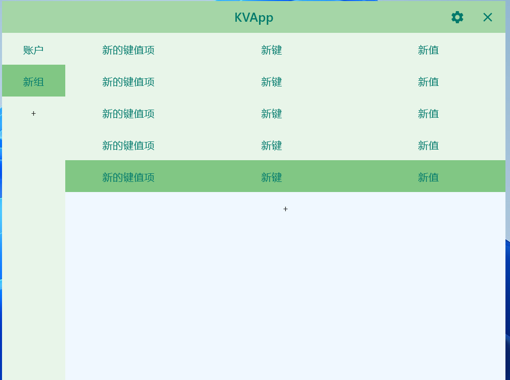
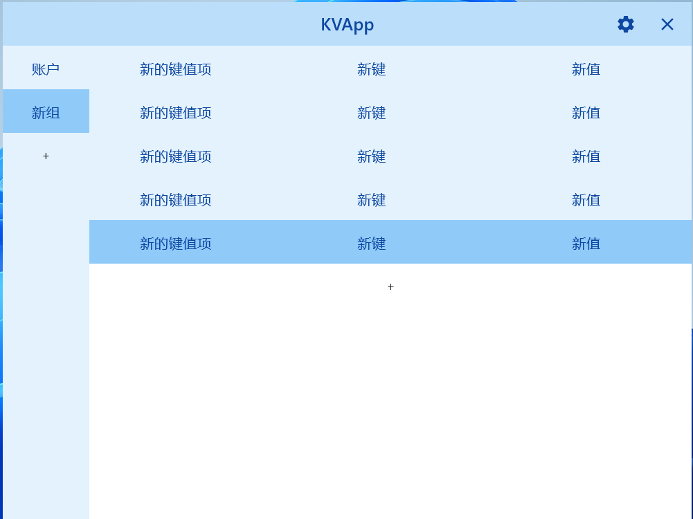

# KVApp

## 描述
该项目是一个基于 Kotlin 的应用程序，允许用户高效地管理键值对和组。用户可以添加、编辑和删除组及键值项，并调整 UI 组件的显示宽度。

## 功能
- 创建、编辑和删除组。
- 添加、编辑和删除键值项。
- 调整组和键值项的显示宽度。
- 友好的用户界面，响应式设计。
- 系统托盘支持，便于快速访问。

## 使用
运行应用程序后，您可以：
- 双击空白区域以添加新组或键值项。
- 双击项以编辑。
- 长按项以删除。
- 使用系统托盘快速访问显示/隐藏应用程序。

## 贡献
欢迎贡献！请随时提交拉取请求或打开问题。

## 许可证
该项目根据 MIT 许可证发布 - 详细信息请参见 [LICENSE](LICENSE) 文件。